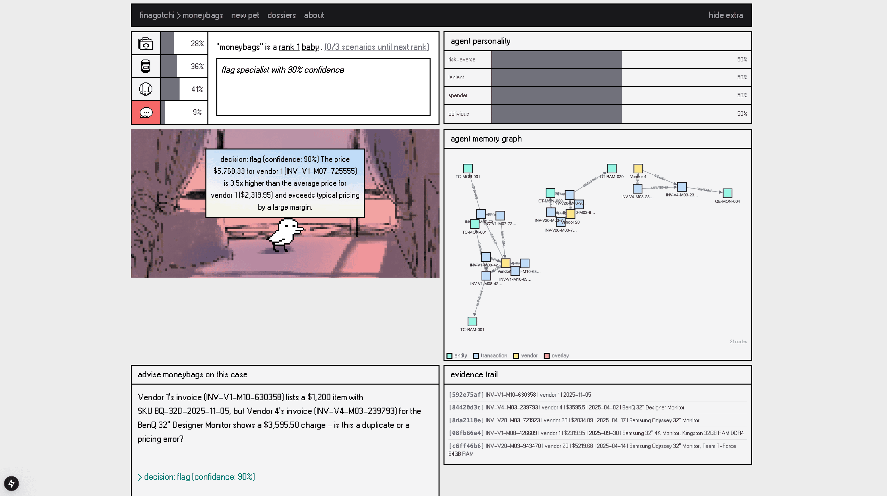

# Finagotchi

Tamagotchi‑inspired AI agent that evolves with financial data. Raise a “Finance Pet” using real ops datasets (vendors, invoices, payments) to build memory‑aware agents for anomaly detection, auditing, and decision workflows.

**Workflow (compressed)**
1. Ingest → Qdrant vectors + Kuzu graph.
2. Runtime → FastAPI + Llama.cpp SLM + Next.js UI (DigitalOcean).
3. Learn → Export JSONL logs to Distil Labs.
4. Act → “Pet” SLM powers OpenClaw agents for autonomous flags/actions.

**Stack**
FastAPI · Llama.cpp (GGUF) · Qdrant · Kuzu · Distil Labs · Next.js · Docker · DigitalOcean

**Why this matters**
Finagotchi was born out of the AI‑Memory Hackathon by Cognee in SF (link: `https://luma.com/50si7fw4`). It makes SLM training and data‑centric AI tangible: you can *see* memory grow, how evidence grounds decisions, and how feedback becomes labeled training data. It’s an educational loop for refining models and policies without hiding the underlying data.

**How the data works**
- **World memory** lives in Qdrant (vector search) and Kuzu (graph relationships).
- **Runtime** embeds each query locally, retrieves evidence from Qdrant, and expands context via Kuzu.
- **Pet memory** is a lightweight overlay (stats + edges) that never mutates the base data.
- **Exports** turn interactions into JSONL for Distil Labs fine‑tuning.

**Docs**
- API overview: `docs/API_OVERVIEW.md`
- V2 PRD: `docs/PRD_v2.md`
- DO deploy: `docs/DEPLOYMENT_DO_CPU.md`

**Swagger**
`http://<backend_ip>:8000/`
