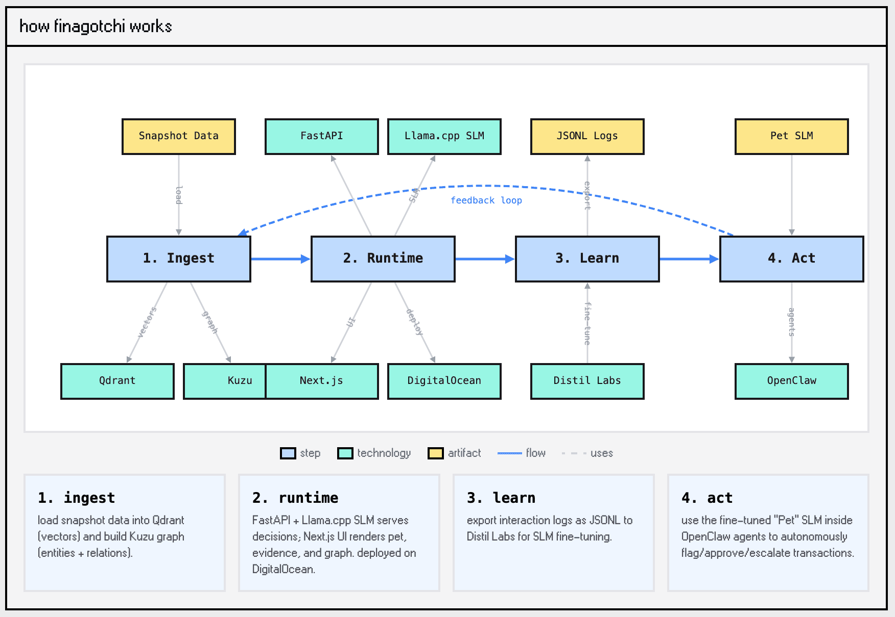

# 🐦 Finagotchi

### What is this cute birdy about?
Tamagotchi‑inspired AI agent that evolves with financial data. Raise a “Finance Pet” using real ops datasets (vendors, invoices, payments) to build memory‑aware agents for anomaly detection, auditing, and decision workflows.

### Why this matters
Finagotchi was born out of the [AI‑Memory Hackathon by Cognee](https://luma.com/50si7fw4) in SF. It makes SLM training and data‑centric AI tangible: you can see memory grow, how evidence grounds decisions, and how feedback becomes labeled training data. It’s an **educational** loop for refining models and policies without hiding the underlying data. Training models and financial compliance could be fun and without knowing it you are building training data for small language models.

### Components
- **World memory** lives in Qdrant (vector search) and Kuzu (graph relationships).
- **Runtime** embeds each query locally, retrieves evidence from Qdrant, and expands context via Kuzu.
- **Pet memory** is a lightweight overlay (stats + edges) that never mutates the base data.
- **Exports** turn interactions into JSONL for Distil Labs fine‑tuning.

> **Note**  
> You’ll need GGUFs to run locally:
> **Distil Labs** SLM: `cognee-distillabs-model-gguf-quantized` & **Cognee** embed model: `nomic-embed-text-v1.5`
> Read more: [ai-memory-hackathon](https://github.com/vincentkoc/ai-memory-hackathon)

### Workflow
1. Ingest → Qdrant vectors + Kuzu graph.
2. Runtime → FastAPI + Llama.cpp SLM + Next.js UI (DigitalOcean).
3. Learn → Export JSONL logs to Distil Labs.
4. Act → “Pet” SLM powers OpenClaw agents for autonomous flags/actions.

### Stack
- Cognee (Memory Layer)
- DigitalOcean (Cloud Deployment)
- Distil Labs (Inference / Small Language Models)
- Docker (Deployment)
- FastAPI (Backend)
- Kuzu (Memory Layer)
- Llama.cpp (Inference)
- Next.js (Frontend)
- Qdrant (Backend Vector DB)
- Terraform (Infrastructure)

### Docs
- API overview: [docs/API_OVERVIEW.md](docs/API_OVERVIEW.md)
- Deployment: [docs/DEPLOYMENT.md](docs/DEPLOYMENT.md)
- DO deploy (CPU): [docs/DEPLOYMENT_DO_CPU.md](docs/DEPLOYMENT_DO_CPU.md)
- DO deploy (GPU): [docs/DEPLOYMENT_DO_GPU.md](docs/DEPLOYMENT_DO_GPU.md)
- Llama.cpp setup: [docs/LLAMA_CPP_SETUP.md](docs/LLAMA_CPP_SETUP.md)
- Once deployed you can navigate to Swagger UI also on `http://<backend_ip>:8000/`

### Made With Love
by [Vincent Koc](https://github.com/vincentkoc)
